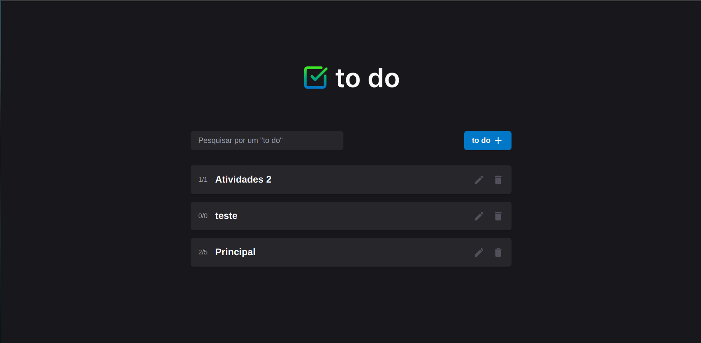
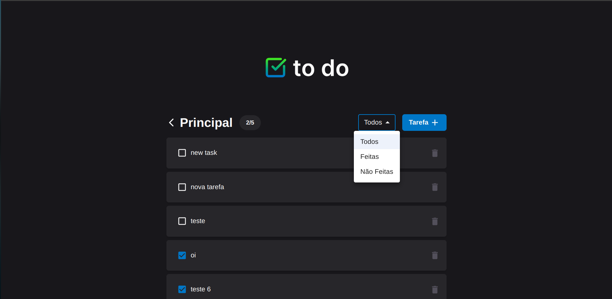

# Aplicação de Lista de Tarefas (To-Do List)

Este projeto é uma aplicação completa de **Lista de Tarefas (To-Do List)**, construída com um backend em Ruby on Rails (API) e um frontend em React. A aplicação permite que os usuários criem várias listas de tarefas, adicionem itens a essas listas e gerenciem suas tarefas de forma eficiente. O frontend foi desenvolvido usando ferramentas modernas de desenvolvimento web, enquanto o backend utiliza Ruby on Rails e PostgreSQL para gerenciamento de banco de dados.

## Funcionalidades

- **Múltiplas Listas de Tarefas**: Crie e gerencie várias listas de tarefas.
- **Gerenciamento de Tarefas**: Adicione, marque ou exclua tarefas dentro de cada lista.
- **Conclusão de Tarefas**: Altere o status de conclusão das tarefas (feitas/não feitas).
- **Filtros**: Filtre as tarefas por status de concluídas e não concluídas.
- **Pesquisa**: Funcionalidade de pesquisa para encontrar listas rapidamente.
- **Interface Amigável**: Interface intuitiva e limpa, construída com React e Tailwind CSS.
- **API Backend**: Construída usando Ruby on Rails com PostgreSQL, oferecendo endpoints para gerenciamento das listas de tarefas e itens.

## Demonstração

### Tela Principal


### Visualização de Lista de Tarefas


## Tecnologias Utilizadas

### Backend (API):
- **Ruby on Rails**: O backend foi construído com Ruby on Rails, seguindo princípios REST.
- **PostgreSQL**: Sistema de banco de dados open-source robusto.
- **Active Record**: ORM integrado do Rails para interações com o banco de dados.
- **API JSON**: O backend expõe uma API JSON para o consumo pelo frontend.

### Frontend:
- **React**: Biblioteca JavaScript para construção de interfaces de usuário.
- **Vite**: Ferramenta de build rápida para projetos web modernos.
- **TypeScript**: Adiciona tipagem estática para maior segurança e manutenção do código.
- **Tailwind CSS**: Framework CSS utilitário para estilização da aplicação.
- **React DOM**: Gerenciamento do DOM virtual no React.
- **Axios**: Para fazer requisições HTTP à API.
- **ESLint**: Linter para garantir a qualidade do código.

## Como Começar

### Pré-requisitos

Antes de rodar este projeto, certifique-se de ter as seguintes dependências instaladas:

- **Ruby** (versão usada 3.3.5)
- **Rails** (versão usada 7.2.1.1)
- **Node.js** (versão usada 20.18.0)
- **PostgreSQL** (versão 13 ou superior)
- **npm** (para gerenciar pacotes do frontend)

### Instalação

1. Clone o repositório:
   ```bash
   git clone https://github.com/iamcaiorian/todo-list.git
   cd todo-list
   ```

2. Configure o backend:

   ```bash
   cd api
   bundle install
   rails db:create db:migrate db:seed
   ```

   **Nota**: Certifique-se de que o PostgreSQL esteja rodando em sua máquina.

3. Configure o frontend:

   ```bash
   cd ../frontend
   npm install
   ```

### Rodando a Aplicação

1. Inicie o servidor Rails (backend):

   ```bash
   cd api
   rails s
   ```

2. Inicie o servidor de desenvolvimento do frontend:

   ```bash
   cd ../frontend
   npm run dev
   ```

3. O frontend estará disponível em `http://localhost:3000`, e a API do Rails rodará em `http://localhost:3001`.

### Endpoints da API

#### Listas

- **GET /lists**: Busca todas as listas de tarefas.
- **POST /lists**: Cria uma nova lista de tarefas.
- **GET /lists/:id**: Busca uma lista específica pelo ID.
- **PUT /lists/:id**: Atualiza uma lista específica.
- **DELETE /lists/:id**: Exclui uma lista específica.

#### Tarefas

- **GET /lists/:list_id/tasks**: Busca todas as tarefas de uma lista específica.
- **POST /lists/:list_id/tasks**: Cria uma nova tarefa em uma lista específica.
- **PUT /tasks/:id**: Atualiza uma tarefa específica.
- **DELETE /tasks/:id**: Exclui uma tarefa específica.

### Estrutura do Projeto

```bash
todo-list-app/
├── api/       # API do backend em Ruby on Rails
│   ├── app/
│   ├── config/
│   ├── db/
│   └── ...
├── frontend/      # Frontend em React com Vite
│   ├── public/
│   ├── src/
│   │   ├── components/
│   │   ├── pages/
│   │   ├── services/
│   │   └── ...
└── README.md      # Arquivo README do projeto
```


## Contato

Se você tiver dúvidas ou precisar de mais informações, entre em contato via [caio.rianbr@gmail.com].
